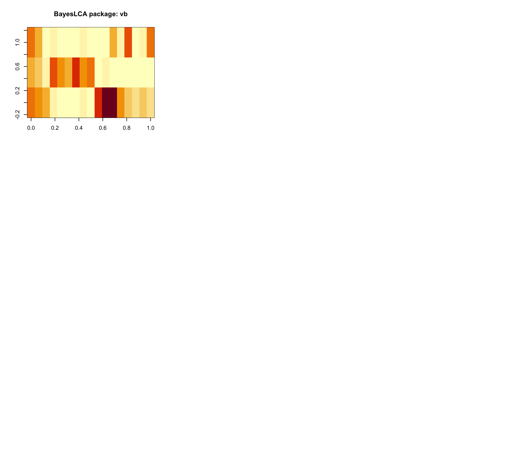

**lotR**: **l**atent class analysis of **o**bservations organized by **t**ree in **R**

An R package for Latent Class Models for Observations Organized by Tree Structure (lotR)

zhenkewu badges:
[](https://travis-ci.org/zhenkewu/lotR)

**Maintainer**: Zhenke Wu, zhenkewu@umich.edu

## Table of content
- [1. Installation](#id-section1)
- [2. Overview](#id-section2)
- [2. Example](#id-section3)

<div id='id-section1'/>

Installation
--------------
```r
install.packages("devtools",repos="https://cloud.r-project.org")
devtools::install_github("zhenkewu/lotR")
```
<div id='id-section2'/>

Overview
----------
To be updated...

**lotR** works for 

* multivariate binary responses
	-  known cut level, pre-specified grouping of observations
    -  unknown cut level, which requires self-adaptive grouping of observations


<div id='id-section3'/>

Examples 
---------

* _lotR_ is self-adaptive: leaves close in the tree means they are more likely to be grouped together.


* _lotR_ produces similar results as `BayesLCA` on fully collapsed tree (ignoring tree information)



